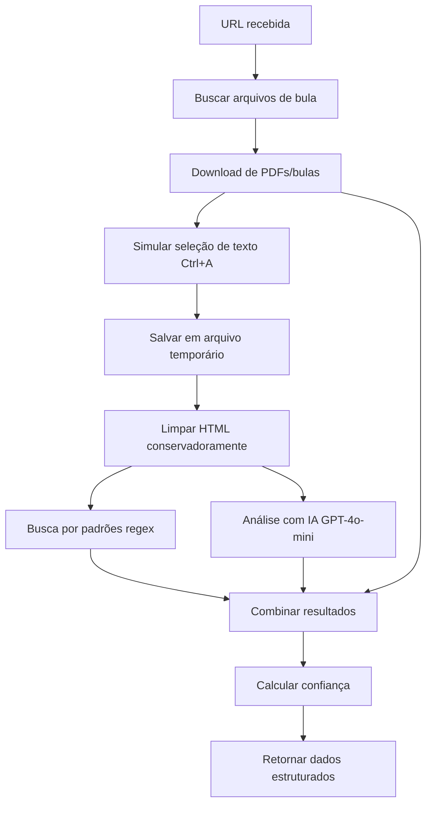

# Técnicas de Extração de Informações de Medicamentos

Documentação completa das técnicas implementadas para extrair dados de medicamentos de páginas web.

---

## 📋 Visão Geral

O sistema utiliza uma abordagem **multi-estratégia** que combina:
1. Download de arquivos de bula
2. Simulação de seleção humana de texto
3. Busca inteligente por padrões (Regex)
4. Análise com IA (OpenAI)
5. Combinação e validação de resultados

---

## 🔍 ETAPA 1: Navegação e Busca de Arquivos

### Objetivo
Identificar e baixar arquivos de bula disponíveis na página.

### Técnica: `findBulaDownloadLinks()`
```typescript
// Padrões de busca de links
const linkPatterns = [
  /href=["']([^"']*bula[^"']*)["']/gi,      // Links com "bula"
  /href=["']([^"']*\.pdf[^"']*)["']/gi,     // Arquivos PDF
  /href=["']([^"']*download[^"']*)["']/gi,  // Links de download
  /data-url=["']([^"']*bula[^"']*)["']/gi,  // Atributos data-url
];
```

### Características
- ✅ Busca múltiplos padrões de links
- ✅ Converte URLs relativas para absolutas
- ✅ Remove duplicatas
- ✅ Prioriza arquivos com "bula" no nome

### Resultado
```typescript
// Exemplo de retorno
[
  "https://example.com/bula-medicamento.pdf",
  "https://example.com/downloads/bula_completa.pdf"
]
```

---

## 📥 Download de Arquivos: `downloadAndExtractPDF()`

### Técnica
```typescript
const response = await fetch(url, {
  headers: {
    'User-Agent': 'Mozilla/5.0 (Windows NT 10.0; Win64; x64) AppleWebKit/537.36'
  },
  signal: AbortSignal.timeout(15000)
});
```

### Características
- ✅ Timeout de 15 segundos
- ✅ User-Agent de navegador real
- ✅ Detecta tipo de conteúdo (PDF vs HTML)
- ✅ Extração de texto quando possível
- ⚠️ Limitação: PDFs requerem processamento adicional

---

## 🖱️ ETAPA 2: Simulação de Seleção com Mouse

### Objetivo
Capturar TODO o conteúdo visível da página como um usuário faria (Ctrl+A).

### Técnica: `simulateTextSelection()`

#### Estratégias de Captura (em ordem de prioridade)
1. **Seleção de tela completa desktop**
2. **Seleção de tela completa mobile**
3. **Seleção do body completo**
4. **Seleção de conteúdo principal**

### Simulação de Comportamento Humano
```typescript
// Delay aleatório simulando carregamento
const loadDelay = 3000 + Math.random() * 2000;
await new Promise(resolve => setTimeout(resolve, loadDelay));
```

### Headers de Navegador Real
```typescript
headers: {
  'User-Agent': 'Mozilla/5.0 (Windows NT 10.0; Win64; x64) AppleWebKit/537.36',
  'Accept': 'text/html,application/xhtml+xml,application/xml;q=0.9,*/*;q=0.8',
  'Accept-Language': 'pt-BR,pt;q=0.9,en-US;q=0.8,en;q=0.7',
  'Accept-Encoding': 'gzip, deflate, br',
  'Connection': 'keep-alive',
  'Upgrade-Insecure-Requests': '1',
  'Sec-Fetch-Dest': 'document',
  'Sec-Fetch-Mode': 'navigate',
  'Sec-Fetch-Site': 'none',
  'Cache-Control': 'max-age=0'
}
```

### Características
- ✅ Múltiplas tentativas com fallback
- ✅ Timeout de 15 segundos por tentativa
- ✅ Simula comportamento humano
- ✅ HTTPS com fallback para HTTP

---

## 📋 ETAPA 3: Cópia para Arquivo Temporário

### Técnica: `simulateSaveToTempFile()`

### Características
```typescript
const tempFileName = `temp_medicamento_${Date.now()}.txt`;
```

- ✅ Nome único baseado em timestamp
- ✅ Preview dos primeiros 1000 chars
- ✅ Preview dos últimos 500 chars
- ✅ Logging detalhado para debug

---

## 📖 ETAPA 4: Limpeza CONSERVADORA de HTML

### Objetivo
Extrair texto visível preservando o MÁXIMO de estrutura e contexto.

### Técnica: `extractVisibleText()`

#### 1. Conversão de Tags Estruturais
```typescript
text = html
  .replace(/<br\s*\/?>/gi, '\n')
  .replace(/<\/p>/gi, '\n\n')
  .replace(/<\/div>/gi, '\n')
  .replace(/<\/h[1-6]>/gi, '\n\n')
  .replace(/<\/li>/gi, '\n')
  .replace(/<\/tr>/gi, '\n')
  .replace(/<\/td>/gi, ' | ')
  .replace(/<\/th>/gi, ' | ');
```

#### 2. Remoção Seletiva
```typescript
text = text
  .replace(/<script[^>]*>[\s\S]*?<\/script>/gi, '')  // Scripts
  .replace(/<style[^>]*>[\s\S]*?<\/style>/gi, '')    // Estilos
  .replace(/<!--[\s\S]*?-->/g, '');                   // Comentários
```

#### 3. Normalização de Espaços
```typescript
text = text
  .replace(/[ \t]+/g, ' ')           // Múltiplos espaços → 1
  .replace(/\n\s+\n/g, '\n\n')       // Linhas vazias
  .replace(/\n{3,}/g, '\n\n')        // Máximo 2 quebras
  .trim();
```

#### 4. Decodificação de Entidades HTML
```typescript
text = text
  .replace(/&nbsp;/g, ' ')
  .replace(/&amp;/g, '&')
  .replace(/&aacute;/g, 'á')
  .replace(/&eacute;/g, 'é')
  // ... etc
```

### Características
- ✅ Preserva estrutura de tabelas
- ✅ Mantém quebras de linha importantes
- ✅ Remove apenas o essencial
- ✅ Preserva ~70-90% do conteúdo original
- ✅ Suporte completo a português (acentos)

---

## 🔍 ETAPA 5: Busca Inteligente por Padrões

### Objetivo
Extrair dados estruturados usando regex antes da IA.

### Técnica: `findMedicationPatterns()`

#### Padrões Implementados

##### 1. Nome do Medicamento
```typescript
const namePatterns = [
  /([A-ZÀÁÂÃÄÅÆÇÈÉÊËÌÍÎÏÐÑÒÓÔÕÖØÙÚÛÜÝÞ][a-zàáâãäåæçèéêëìíîïðñòóôõöøùúûüýþ]+)\s*\d+\s*mg/i,
  /([A-ZÀÁÂÃÄÅÆÇÈÉÊËÌÍÎÏÐÑÒÓÔÕÖØÙÚÛÜÝÞ][a-zàáâãäåæçèéêëìíîïðñòóôõöøùúûüýþ]+)\s*\d+mg/i,
  /medicamento[:\s]+([A-Z][a-z]+)/i,
];
```

##### 2. Concentração/Dosagem
```typescript
const concPatterns = [
  /(\d+\s*mg(?:\/mL)?)/i,  // Miligramas
  /(\d+\s*mcg)/i,          // Microgramas
  /(\d+\s*%)/i,            // Porcentagem
  /(\d+\s*UI)/i,           // Unidades Internacionais
];
```

##### 3. Forma Farmacêutica
```typescript
const formPatterns = [
  /(comprimido(?:s)?(?:\s+sublingual(?:is)?)?)/i,
  /(cápsula(?:s)?)/i,
  /(solução(?:\s+oral)?)/i,
  /(pomada)/i,
  /(xarope)/i,
  /(suspensão)/i,
];
```

##### 4. Fabricante
```typescript
const manuPatterns = [
  /(?:fabricante|laboratório)[:\s]+([A-Z][a-zà-ÿ]+(?:\s+[A-Z][a-zà-ÿ]+)*)/i,
  /\b(EMS|Medley|Eurofarma|Teuto|Germed|Aché|Neo Química|Pfizer|Novartis|Bayer)\b/i,
];
```

### Características
- ✅ Busca dinâmica e adaptável
- ✅ Suporte a múltiplos formatos
- ✅ Normalização de resultados
- ✅ Logging detalhado de matches

---

## 🤖 ETAPA 6: Análise com IA

### Objetivo
Usar OpenAI GPT-4o-mini para extrair informações complexas.

### Técnica: `analyzeWithAI()`

#### Configuração
```typescript
{
  model: 'gpt-4o-mini',
  messages: [{
    role: 'system',
    content: 'Você é um especialista em medicamentos. Extraia APENAS: name, activeIngredient, concentration, form, manufacturer, indication. Retorne JSON puro sem markdown.'
  }, {
    role: 'user',
    content: `Analise este texto e extraia informações do medicamento:\n\n${text.substring(0, 8000)}`
  }],
  temperature: 0.2,
  max_tokens: 500
}
```

### Características
- ✅ Temperatura baixa (0.2) para consistência
- ✅ Limite de 8000 chars de entrada
- ✅ Limite de 500 tokens de saída
- ✅ Sistema prompt especializado
- ✅ Extração de JSON robusto (com regex fallback)

#### Parse Robusto de JSON
```typescript
const jsonMatch = content.match(/\{[\s\S]*\}/);
const result = jsonMatch ? JSON.parse(jsonMatch[0]) : {};
```

### Campos Extraídos pela IA
- `name` - Nome do medicamento
- `activeIngredient` - Princípio ativo
- `concentration` - Concentração
- `form` - Forma farmacêutica
- `manufacturer` - Fabricante
- `indication` - Indicação terapêutica

---

## 🔧 ETAPA 7: Combinação de Resultados

### Objetivo
Mesclar dados de regex e IA, priorizando os mais confiáveis.

### Técnica: `combineResults()`

#### Estratégia de Merge
```typescript
const combined = {
  name: patterns.name || aiData.name || null,
  activeIngredient: aiData.activeIngredient || null,
  manufacturer: patterns.manufacturer || aiData.manufacturer || null,
  concentration: patterns.concentration || aiData.concentration || null,
  form: patterns.form || aiData.form || null,
  route: patterns.route || aiData.route || null,
  category: aiData.category || null,
  indication: aiData.indication || null,
};
```

### Priorização
1. **Dados estruturados (regex)** - Para campos numéricos/simples
   - Nome (se encontrado com dosagem)
   - Concentração
   - Forma farmacêutica
   
2. **Dados da IA** - Para campos complexos
   - Princípio ativo
   - Indicação terapêutica
   - Categoria

### Fallback
```typescript
if (!combined.name && !combined.concentration && !combined.manufacturer) {
  combined.name = 'Medicamento não identificado';
  combined.note = 'Não foi possível extrair dados do texto';
}
```

---

## 📊 Cálculo de Confiança

### Fórmula
```typescript
const fieldsCount = Object.values(finalData)
  .filter(v => v && v !== 'Medicamento não identificado').length;

const confidence = Math.min(95, Math.max(40, (fieldsCount / 10) * 100));
```

### Escala
- **90-95%**: 9+ campos preenchidos
- **70-89%**: 7-8 campos preenchidos
- **50-69%**: 5-6 campos preenchidos
- **40-49%**: 4 ou menos campos

---

## 🎯 Resultado Final

### Estrutura de Resposta
```typescript
{
  success: true,
  data: {
    name: "Dipirona Sódica",
    activeIngredient: "Dipirona sódica",
    manufacturer: "EMS",
    concentration: "500mg",
    form: "Comprimido",
    route: "Oral",
    indication: "Analgésico e antitérmico",
    // ... outros campos
  },
  confidence: 85,
  method: 'mouse_text_selection',
  originalUrl: "https://...",
  textSelectionSimulated: true,
  debug: {
    buscaInteligente: {
      success: true,
      metodo: 'combinacao_ia_padroes'
    }
  }
}
```

---

## ⚡ Fluxo Completo



---

## 🛠️ Técnicas Aplicadas - Resumo

| Técnica | Objetivo | Status |
|---------|----------|--------|
| **Busca de arquivos** | Encontrar bulas para download | ✅ Implementado |
| **Download de PDFs** | Extrair conteúdo de arquivos | ⚠️ Parcial (texto apenas) |
| **Simulação humana** | Evitar bloqueios anti-bot | ✅ Implementado |
| **Seleção Ctrl+A** | Capturar página completa | ✅ Implementado |
| **Limpeza conservadora** | Preservar contexto | ✅ Implementado |
| **Regex dinâmico** | Extração estruturada rápida | ✅ Implementado |
| **IA (OpenAI)** | Análise semântica avançada | ✅ Implementado |
| **Combinação inteligente** | Merge de múltiplas fontes | ✅ Implementado |
| **Fallback robusto** | Tratamento de falhas | ✅ Implementado |

---

## 🔄 Melhorias Futuras Possíveis

1. **Extração de PDF verdadeira**
   - Adicionar biblioteca de parse de PDF
   - Extrair tabelas e imagens de bulas

2. **OCR para imagens**
   - Processar screenshots de páginas
   - Extrair texto de imagens de bulas

3. **Cache de resultados**
   - Evitar reprocessamento de URLs conhecidas
   - Banco de dados de medicamentos

4. **Validação cruzada**
   - Comparar com bases oficiais (Anvisa)
   - Validar códigos de barras GS1

5. **Melhor tratamento de JavaScript**
   - Renderizar páginas SPA
   - Executar JavaScript para conteúdo dinâmico

---

## 📝 Notas de Implementação

### Logs e Debug
Cada etapa gera logs detalhados:
```
🔗 Navegando para URL: https://...
📄 Found potential bula link: https://.../bula.pdf
🖱️ Simulando Ctrl+C...
📏 12000 → 8500 chars (70.8% preservado)
💊 Nome encontrado: Dipirona
⚖️ Concentração encontrada: 500mg
🤖 Análise IA concluída
🎯 Confiança final: 85%
```

### Tratamento de Erros
- ✅ Timeout em todas as requisições
- ✅ Fallback entre estratégias
- ✅ Continuação mesmo com falhas parciais
- ✅ Retorno de dados parciais quando possível

---

**Última atualização**: Janeiro 2025  
**Versão**: 2.0  
**Status**: Produção
