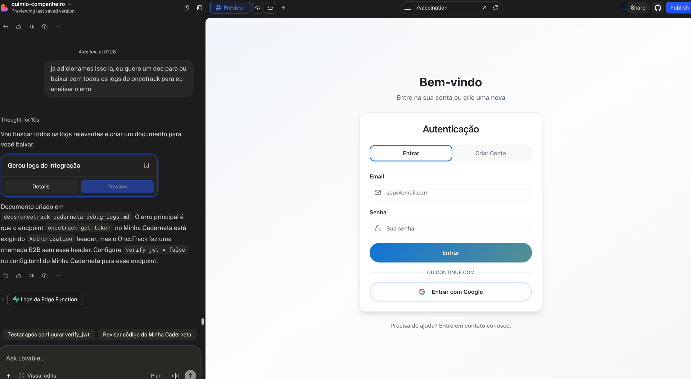

# OncoTrack ↔ Minha Caderneta — Snapshot de Logs (2026-02-04 05:06 UTC)

Este arquivo contém um recorte **atualizado** para análise rápida do fluxo de conexão (B2B handshake).

> Obs.: qualquer token/header sensível foi **redigido**.

---

## 1) Screenshot (tela após “Conectar Minha Caderneta”)



---

## 2) Edge Function Logs (OncoTrack) — `complete-caderneta-connection`

Fonte: Supabase Edge Function logs.

```text
2026-02-04T05:04:33Z LOG shutdown
2026-02-04T05:04:33Z LOG shutdown
2026-02-04T05:03:21Z INFO Connection saved successfully for user: 4152a7eb-5e5c-4035-bd3d-fef71a977f78
2026-02-04T05:03:21Z INFO Token received, saving connection...
2026-02-04T05:03:18Z INFO Completing connection for user: 4152a7eb-5e5c-4035-bd3d-fef71a977f78
2026-02-04T05:03:18Z LOG booted (time: 44ms)
2026-02-04T05:03:18Z LOG booted (time: 28ms)

2026-02-04T04:56:27Z ERROR Failed to get token from Minha Caderneta: {"code":401,"message":"Missing authorization header"}
2026-02-04T04:56:27Z INFO Completing connection for user: 4152a7eb-5e5c-4035-bd3d-fef71a977f78
2026-02-04T04:56:27Z LOG booted (time: 24ms)
2026-02-04T04:56:27Z LOG booted (time: 29ms)
```

### Interpretação rápida

- Houve um erro **401** às **04:56:27Z** (Minha Caderneta exigindo `Authorization`).
- Houve execução **bem-sucedida** às **05:03:21Z**, indicando que o token foi obtido e a conexão foi persistida no OncoTrack.

---

## 3) Snapshot de Rede (Preview OncoTrack)

Consultas do front-end ao Supabase para verificar conexão ativa.

### 2026-02-04T04:56:02Z

- **Request:** `GET /rest/v1/external_connections?select=*&user_id=eq.4152a7eb-...&provider=eq.minha_caderneta&status=eq.active`
- **Status:** `200`
- **Response:** `[]`

### 2026-02-04T04:57:37Z

- **Request:** `GET /rest/v1/external_connections?select=*&user_id=eq.4152a7eb-...&provider=eq.minha_caderneta&status=eq.active`
- **Status:** `200`
- **Response:** `[]`

### 2026-02-04T05:01:45Z

- **Request:** `GET /rest/v1/external_connections?select=*&user_id=eq.4152a7eb-...&provider=eq.minha_caderneta&status=eq.active`
- **Status:** `200`
- **Response:** `[]`

### Interpretação

Essas leituras mostram “sem conexão ativa” **até 05:01:45Z**. A conexão foi criada **depois** (05:03:21Z), então esse snapshot é consistente.

---

## 4) Consulta no Banco (Test DB) — `external_connections`

Consulta feita no Supabase do OncoTrack:

```sql
select id, user_id, provider, status, connected_at, created_at, updated_at, last_sync_at
from public.external_connections
where user_id = '4152a7eb-5e5c-4035-bd3d-fef71a977f78'
order by created_at desc
limit 20;
```

Resultado:

```json
[
  {
    "id": "6cfd6ee0-94d1-49e3-9fad-8141626869cf",
    "user_id": "4152a7eb-5e5c-4035-bd3d-fef71a977f78",
    "provider": "minha_caderneta",
    "status": "active",
    "connected_at": "2026-02-04T05:03:21.209Z",
    "created_at": "2026-02-04T05:03:21.24857Z",
    "updated_at": "2026-02-04T05:03:21.24857Z",
    "last_sync_at": null
  }
]
```

### Interpretação

✅ O OncoTrack tem **1 conexão ativa** salva para o usuário acima desde **05:03:21Z**.

---

## 5) Próximo passo sugerido (para isolar o erro atual)

1. Recarregar `/vaccination` após 05:03Z e confirmar se a UI passa a detectar a conexão.
2. Se a tela do screenshot ainda aparece, anotar exatamente a URL exibida nela (domínio + path + query) para cruzar com a allowlist/validação do Minha Caderneta.
